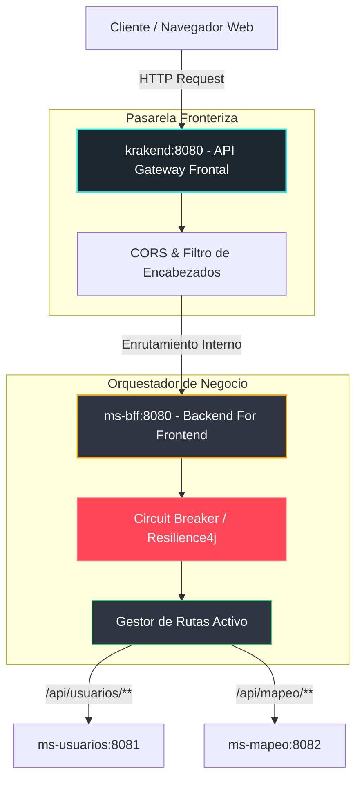

# MS-BFF (Backend For Frontend Component)
## Pasarela Centralizadora y Orquestadora de Servicios - Comuna Valle del Sol

El microservicio **`ms-bff`** actúa como la pasarela orquestadora de negocio interna dentro del ecosistema de microservicios de la Municipalidad Valle del Sol. Construido sobre **Spring Boot** y **Spring Cloud Gateway**, implementa políticas de resiliencia avanzadas mediante disyuntores de fallo (**Circuit Breakers**) y actúa como el concentrador e integrador lógico entre el API Gateway frontal (KrakenD) y los microservicios funcionales.

---

## 1. Arquitectura y Patrones de Diseño

Este componente adopta patrones clave de diseño de sistemas distribuidos para garantizar la seguridad, robustez y resiliencia:

1. **Patrón Backend For Frontend (BFF):**
   - Recibe las solicitudes limpias y autorizadas desde el API Gateway (KrakenD).
   - Centraliza y simplifica el direccionamiento hacia los microservicios dedicados del ecosistema.
2. **Patrón Circuit Breaker (Disyuntor) con Resilience4j:**
   - Previene fallos en cascada. Si un microservicio decae en su rendimiento o colapsa temporalmente (por ejemplo, `ms-mapeo` bajo carga pesada), el disyuntor entra en estado "Abierto" bloqueando peticiones adicionales y respondiendo de forma segura antes de sobrecargar la red municipal.

---

## 2. Diagrama de Arquitectura del BFF (Flujo Invertido)

El siguiente diagrama modela cómo fluye la petición HTTP desde la interfaz externa pasando por la pasarela de seguridad del API Gateway (KrakenD), la pasarela de resiliencia del BFF y su enrutamiento hacia los microservicios:



---

## 3. Tecnologías y Librerías Clave

- **Spring Boot 3.3.x:** Base estructural del servicio.
- **Spring Cloud Gateway MVC:** Motor de ruteo ágil para interceptación de flujos.
- **Resilience4j & Spring Cloud CircuitBreaker:** Librerías para implementar el disyuntor tolerante a fallos.
- **Maven:** Gestor de dependencias e integración continua.

---

## 4. Configuración y Setup del Servicio

### Requisitos previos
- **Java 21 / 25 LTS** instalado.
- **Maven 3.8+** instalado.

### Instalación Individual
1. Navega al directorio `/ms-bff`:
   ```bash
   cd ms-bff
   ```
2. Ejecuta la compilación y empaquetado del código utilizando Maven:
   ```bash
   mvn clean package -DskipTests
   ```
3. Levanta el microservicio BFF de manera directa:
   ```bash
   mvn spring-boot:run
   ```
4. El servicio estará activo y escuchando en el puerto interno: **`8080`** (Exhibido externamente en Docker en el puerto `8090`).

### Configuración del Disyuntor (`application.yml`)
El comportamiento del Circuit Breaker se define de la siguiente manera:
- **`slidingWindowSize: 10`:** Ventana de llamadas bajo análisis.
- **`failureRateThreshold: 50`:** Si más del 50% de las llamadas fallan, el circuito se abre inmediatamente.
- **`waitDurationInOpenState: 50s`:** El circuito permanecerá abierto durante 50 segundos antes de intentar reconectarse (estado Medio-Abierto).

---

## 5. Mappings y Rutas del BFF

El BFF expone e intercepta los siguientes patrones de rutas provenientes de KrakenD y los redirecciona de manera directa a los microservicios correspondientes:

- **/api/usuarios/\*\*** $\rightarrow$ Redirige directamente al microservicio de usuarios (`http://ms-usuarios:8081`) para autenticación, registro y perfiles de usuarios.
- **/api/mapeo/\*\*** $\rightarrow$ Redirige directamente al microservicio de mapeo (`http://ms-mapeo:8082`) para reportes y visualización geográfica.
