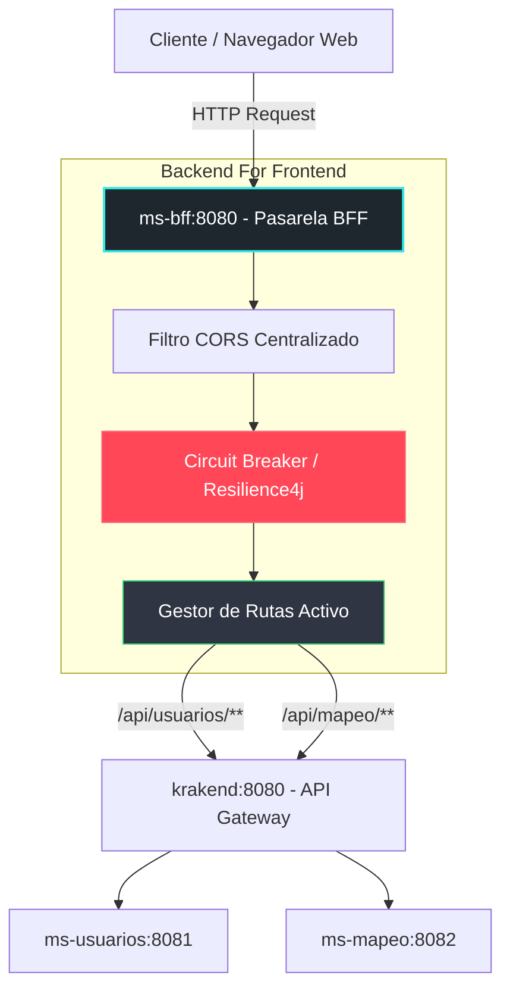

# MS-BFF (Backend For Frontend Component)
## Pasarela Centralizadora y Orquestadora de Servicios - Comuna Valle del Sol

El microservicio **`ms-bff`** actúa como la pasarela y único punto de contacto expuesto externamente al cliente (frontend). Construido sobre **Spring Cloud Gateway**, implementa políticas de resiliencia avanzadas mediante disyuntores de fallo (**Circuit Breakers**) y centraliza de forma segura la gestión de intercambio de recursos de origen cruzado (CORS), aislando la infraestructura de microservicios internos.

---

## 1. Arquitectura y Patrones de Diseño

Este componente adopta patrones clave de diseño de sistemas distribuidos para garantizar la seguridad y resiliencia:

1. **Patrón Backend For Frontend (BFF):**
   - Aísla al frontend de la complejidad del mapa de red de los microservicios internos.
   - Enruta de manera uniforme peticiones hacia los endpoints expuestos mediante el gateway de KrakenD e internos.
2. **Patrón Circuit Breaker (Disyuntor) con Resilience4j:**
   - Previene fallos en cascada. Si un microservicio decae en su rendimiento o colapsa temporalmente, el disyuntor entra en estado "Abierto" bloqueando peticiones adicionales y respondiendo de forma segura antes de sobrecargar la red municipal.
3. **Filtro Centralizado de Origen Cruzado (CORS Filter):**
   - Evita la duplicación de cabeceras CORS en controladores individuales (lo que provocaría bloqueos a nivel de navegador) centralizando políticas de aceptación de orígenes (`*`), métodos HTTP (`GET`, `POST`, `PUT`, `DELETE`, `OPTIONS`) y cabeceras personalizadas (`Authorization`, `Content-Type`).

---

## 2. Diagrama de Arquitectura del BFF

El siguiente diagrama modela cómo fluye la petición HTTP desde la interfaz externa pasando por la pasarela de seguridad del BFF y su ruteo asíncrono y síncrono interno:



---

## 3. Tecnologías y Librerías Clave

- **Spring Boot 3.3.x:** Base estructural del servicio.
- **Spring Cloud Gateway MVC:** Motor de ruteo ágil para interceptación de flujos.
- **Resilience4j & Spring Cloud CircuitBreaker:** Librerías para implementar el disyuntor tolerante a fallos.
- **Maven:** Gestor de dependencias e integración continua.

---

## 4. Configuración y Setup del Servicio

### Requisitos previos
- **Java 21 / 25 LTS** instalado.
- **Maven 3.8+** instalado.

### Instalación Individual
1. Navega al directorio `/ms-bff`:
   ```bash
   cd ms-bff
   ```
2. Ejecuta la compilación y empaquetado del código utilizando Maven:
   ```bash
   mvn clean package -DskipTests
   ```
3. Levanta el microservicio BFF de manera directa:
   ```bash
   mvn spring-boot:run
   ```
4. El servicio estará activo y escuchando en el puerto: **`8080`**.

### Configuración del Disyuntor (`application.yml`)
El comportamiento del Circuit Breaker se define de la siguiente manera:
- **`slidingWindowSize: 10`:** Ventana de llamadas bajo análisis.
- **`failureRateThreshold: 50`:** Si más del 50% de las llamadas fallan, el circuito se abre inmediatamente.
- **`waitDurationInOpenState: 50s`:** El circuito permanecerá abierto durante 50 segundos antes de intentar reconectarse (estado Medio-Abierto).

---

## 5. Mappings y Rutas del BFF

El BFF expone e intercepta los siguientes patrones de rutas, mapeándolos dinámicamente hacia KrakenD para su enrutamiento final aguas abajo:

- **/api/usuarios/\*\*** $\rightarrow$ Redirige al API Gateway (`http://krakend:8080`) para autenticación y perfiles de usuarios.
- **/api/mapeo/\*\*** $\rightarrow$ Redirige al API Gateway (`http://krakend:8080`) para reportes y visualización geográfica.
