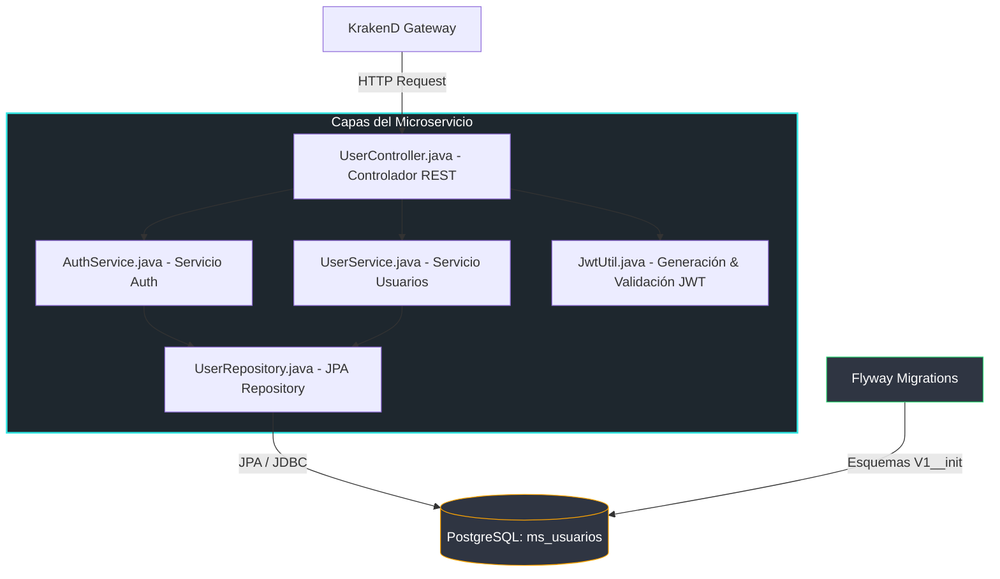

# MS-Usuarios (User Microservice Component)
## Módulo de Registro, Autenticación y Control de Accesos - Comuna Valle del Sol

El microservicio **`ms-usuarios`** es el componente encargado de gestionar la información de los usuarios (ciudadanos, brigadistas y administradores) en la plataforma. Implementa mecanismos de autenticación mediante JSON Web Tokens (JWT) inyectando reclamos de roles (RBAC) y control de perfiles seguros.

---

## 1. Arquitectura y Patrones de Diseño

Este microservicio se fundamenta en sólidos patrones de diseño de software empresarial para garantizar robustez y escalabilidad:

1. **Repository Pattern (Patrón Repositorio):**
   - Implementado a través de **Spring Data JPA** (`UserRepository.java`). Abstrae por completo el acceso físico a los datos relacionales en PostgreSQL, exponiendo métodos de alto nivel y manteniendo el desacoplamiento de la base de datos.
2. **DTO Pattern (Objeto de Transferencia de Datos):**
   - Utiliza **`UserDTO`** para transferir información pública al frontend, bloqueando información crítica como la contraseña hash y previniendo fugas de datos sensibles.
3. **Manejo Global de Excepciones (ControllerAdvice):**
   - Centraliza el control de errores mediante clases decoradas con `@ControllerAdvice`, capturando excepciones imprevistas y retornando respuestas estandarizadas al cliente con los códigos HTTP precisos (`401`, `403`, `404`, `500`).
4. **Estrategia de Migración de Datos (Flyway):**
   - Mantiene la consistencia de la base de datos a lo largo de los despliegues de desarrollo y producción de forma automática mediante scripts versionados controlando el versionamiento del esquema físico.
5. **Seguridad JWT Estática Determinista (RBAC):**
   - Genera tokens criptográficamente firmados con algoritmo HMAC-SHA a través de una clave estática compartida por el ecosistema. Inyecta el rol del usuario permitiendo validar de forma distribuida el acceso seguro.

---

## 2. Diagrama del Microservicio de Usuarios

El siguiente diagrama detalla la arquitectura de capas interna del componente y su conexión con la base de datos de PostgreSQL administrada por Flyway:



---

## 3. Tecnologías y Librerías Clave

- **Spring Boot 3.3.x:** Framework de desarrollo principal.
- **Spring Data JPA:** Abstracción y operaciones de persistencia relacional.
- **Flyway Database Migration:** Versionamiento físico de bases de datos.
- **jjwt (Java JWT):** Librería para creación, firma y lectura de tokens seguros.
- **Lombok:** Eliminación de código boilerplate (Getters, Setters, Constructores).

---

## 4. Configuración y Setup del Servicio

### Requisitos previos
- **Java 21 / 25 LTS** instalado.
- **Maven 3.8+** instalado.
- Servidor **PostgreSQL** activo (puerto `5432`).

### Instalación Individual
1. Navega al directorio `/ms-usuarios`:
   ```bash
   cd ms-usuarios
   ```
2. Configura las variables de conexión en `src/main/resources/application.yml` o inyéctalas como entorno:
   - `SPRING_DATASOURCE_URL=jdbc:postgresql://localhost:5432/ms_usuarios`
   - `SPRING_DATASOURCE_USERNAME=postgres`
   - `SPRING_DATASOURCE_PASSWORD=postgres`
3. Ejecuta la compilación y empaquetado del código utilizando Maven:
   ```bash
   mvn clean package -DskipTests
   ```
4. Levanta el microservicio:
   ```bash
   mvn spring-boot:run
   ```
5. El servicio estará activo y escuchando en el puerto: **`8081`**.

---

## 5. Detalles de Endpoints de la API

El microservicio expone de forma directa los siguientes endpoints:

| Método | Endpoint | Cabecera Auth | Descripción |
| :--- | :--- | :--- | :--- |
| **POST** | `/api/usuarios/auth/register` | No requerida | Registra un nuevo usuario con localización, correo, teléfono y rol. |
| **POST** | `/api/usuarios/auth/login` | No requerida | Autentica un usuario y genera su correspondiente Bearer JWT token. |
| **GET** | `/api/usuarios/users/{id}` | Requerida (Bearer) | Obtiene los detalles públicos del perfil de un usuario. |
| **PUT** | `/api/usuarios/users/{id}` | Requerida (Bearer) | Actualiza el perfil de forma segura (Solo Dueño o Administradores). |

---

## 6. Pruebas Unitarias

Para verificar la robustez del componente y la cobertura del código:
```bash
mvn test
```
Los tests verifican de manera unitaria e integrada los servicios de autenticación y de obtención de perfiles de usuario.
